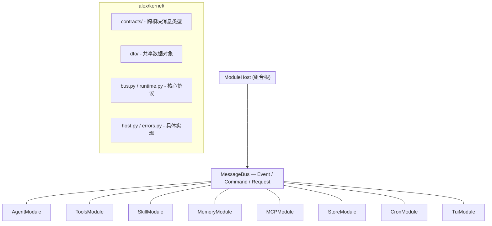

<p align="center">
  <picture>
    <source media="(prefers-color-scheme: dark)">
    
  </picture>
</p>

<p align="center">
  <strong>A terminal-native AI agent that learns from every conversation.</strong>
</p>

<p align="center">
  <a href="#license"></a>
  <a href="https://www.python.org/downloads/"></a>
  <a href="#"></a>
  <a href="#"></a>
</p>

---

<a href="README_CN.md">中文文档</a>

Alex is an agent that lives in your terminal — reads files, writes patches, runs shells, searches the web, schedules recurring jobs, and **gets better over time** as it distills strategies from past conversations.

### Why Alex?

- **Reaches into your project** — read files, search by content (`grep`) or name (`glob`), write atomic patches, run `bash` or `pwsh`
- **Web-connected** — DuckDuckGo search and clean page extraction
- **Cron scheduler** — Schedule prompt-driven background jobs with 5-field cron and optional durable persistence; durable jobs are restored after restart, rebound to the current session, and still run only while Alex is open and idle
- **Permission-gated** — Side-effect tools require explicit approval; you see a unified diff for every write before it lands
- **Auditable** — Every approval / denial appended to `~/.alex/audit/permissions.jsonl`
- **MCP-ready** — Auto-discovers Model Context Protocol servers from `~/.alex/mcp.json`, including stdio and HTTP transports
- **Plugin-friendly** — Drop a `*.py` file in `~/.alex/plugins/` to add your own tools
- **Sees its reasoning** — DeepSeek thinking mode reveals *how* the agent reached an answer
- **Gets better with use** — Distills reusable skills from conversations; thumbs up/down steer evolution
- **Markdown rendering** — Final responses render code blocks, lists, headings, inline code with proper terminal styling

## Installation

### Prerequisites

- **Python 3.12+**
- [`uv`](https://docs.astral.sh/uv/) (recommended) or `pip`
- Optional: `rg` (ripgrep) for fast `grep`; `bash` and/or `pwsh` for shell tools; `git` for `git_inspect`

### Setup

```bash
git clone https://github.com/myhMARS/alex.git
cd alex

# Recommended: uv handles the venv and lockfile for you
uv sync
```

### Configure

```bash
cp .env_example .env
```

Edit `.env` — at minimum set your API key:

| Variable | Description | Default |
|----------|-------------|---------|
| `ALEX_PROVIDER` | LLM provider (`deepseek`, `openai`, `anthropic`) | `deepseek` |
| `ALEX_API_KEY` | API key *(required)* | — |
| `ALEX_BASE_URL` | API base URL | `https://api.deepseek.com` |
| `ALEX_MODEL` | Model name | `deepseek-chat` |
| `ALEX_MAX_TOKENS` | Max tokens per response | `8192` |
| `ALEX_TEMPERATURE` | Sampling temperature | `0.0` |
| `ALEX_TOOL_PERMISSIONS` | Comma list of permissions to allow without prompting | `read,network` |
| `ALEX_TOOL_DENY` | Comma list of permissions to always deny | — |
| `ALEX_TUI_MARKDOWN` | Set to `0` to disable Markdown rendering | `1` |
| `ALEX_CRON_DEBUG` | Set to `1` for verbose cron logs | — |

## Usage

```bash
uv run python main.py
# Or via installed entry point:
alex
```

### TUI Shortcuts

| Key | Action |
|-----|--------|
| <kbd>Ctrl+T</kbd> | Toggle thinking / reasoning visibility |
| <kbd>Ctrl+K</kbd> | Toggle skill blocks |
| <kbd>Ctrl+G</kbd> | Rate last response helpful |
| <kbd>Ctrl+B</kbd> | Rate last response unhelpful (triggers reflection) |
| <kbd>Ctrl+C</kbd> | Quit |

### TUI Commands

| Command | Action |
|---------|--------|
| `/help` | Show all commands and shortcuts |
| `/skills` | Browse learned skills with usage stats |
| `/skills del <id>` | Delete a skill by name or prefix |
| `/skills dep <id>` | Deprecate a skill |
| `/merge-skills` | LLM-powered skill deduplication |
| `/reflect` | Force a reflection cycle |
| `/cron [query]` | Show current cron jobs |
| `/resume` | Restore a saved session |
| `/clear` | Clear current session |
| `/quit` | Exit |
| `:q` | Close any overlay panel |
| `/x` | Dismiss the current toast |

### Permission Confirm Modal

When the agent calls a tool that needs an unusual permission (e.g. writing a file or running a shell command), Alex pauses with a modal showing the proposed change before running it:

| Key | Decision |
|-----|----------|
| <kbd>Y</kbd> / <kbd>A</kbd> | Allow once |
| <kbd>S</kbd> | Allow for the rest of this session |
| <kbd>N</kbd> / <kbd>Esc</kbd> | Deny — the tool returns a `blocked` error and the model can adapt |

For `write` and `edit`, the modal includes a unified diff against the current file so you can review every line that's about to change. For `bash` / `pwsh`, you see the full command, working directory, and timeout.

Every decision is appended to `~/.alex/audit/permissions.jsonl`.

### Tools Available to the Agent

| Tool | Permission | Purpose |
|------|------------|---------|
| `time` | — | Current date/time, timezone-aware |
| `web_search` | `network` | DuckDuckGo search |
| `web_fetch` | `network` | Clean text extraction from a URL |
| `cron` | — | Schedule prompt-driven background jobs with 5-field cron; `prompt` must be only the real task content, without reminder wrappers, elapsed-time wording, or decorative text |
| `read` | `read` | Read a text file with binary detection and size cap |
| `write` | `write` | Atomic full-file write — diff shown before approval |
| `edit` | `write` | Precise string replacement; requires prior `read` and detects external edits |
| `glob` | `read` | Find files by name pattern, sorted by `mtime` |
| `grep` | `read` | Regex content search (uses `rg` when available, pure-Python fallback) |
| `git_inspect` | `read` | Read-only `git status` / `diff` / `log` |
| `bash` | `shell` | Run a `bash -lc` command with hard deny list (`rm`, `dd`, `sudo`, …) |
| `pwsh` | `shell` | Run a PowerShell command with hard deny list (`Remove-Item`, `Format-Volume`, `iex`, …) |
| `load_skill` | — | Built-in: load full execution methodology for a skill |
| `list_skills` | — | Built-in: browse available skills |
| `cron_jobs` | — | Built-in: query current cron jobs, including durable jobs |
| MCP tools | `network` | Anything exposed by an MCP server in `~/.alex/mcp.json` |
| User plugins | — | Anything dropped into `~/.alex/plugins/*.py` |

### Cron Notes

- `durable=false` keeps a job only for the current app lifetime
- `durable=true` persists the job definition to `~/.alex/cron/`, restores it on restart, and rebinds it to the current session
- Restored jobs do not run while Alex is closed; they resume only when the TUI is open and idle
- The right-hand `定时任务` panel shows active cron jobs and refreshes the `next:` countdown every second
- The `prompt` should describe only the task to perform, not reminder phrasing like elapsed-time/status text or UI-style wrapper text

### Cron Tool Quick Example

```
You: Search "AI news" every 10 minutes and tell me the top headline

Alex: [schedules a cron job via the cron tool]

# 10 minutes later, a new bubble appears in chat with the latest headline
```

### MCP Servers

Drop a config into `~/.alex/mcp.json`:

```json
{
  "mcpServers": {
    "local-server": {
      "command": "your-mcp-command",
      "args": ["--your-arg", "value"]
    },
    "http-server": {
      "url": "http://localhost:8000/mcp",
      "headers": {
        "Authorization": "Bearer token-value",
        "X-Custom-Header": "custom-value"
      }
    },
    "sse-server": {
      "transport": "sse",
      "url": "http://localhost:8123/sse",
      "headers": {"Authorization": "Bearer token-value"},
      "timeout": 15,
      "sse_read_timeout": 60
    }
  }
}
```

Config rules:

- `command` means stdio transport
- `url` means HTTP transport and defaults to `streamable-http`
- `transport` currently accepts `stdio`, `streamable-http`, or `sse`
- `headers` are forwarded to HTTP MCP servers
- `timeout` and `sse_read_timeout` are optional HTTP transport settings
- `disabled: true` keeps the entry in config but skips connecting

Tools surface as `mcp__<server>__<tool>` and inherit the `network` permission. Servers connect in the background on TUI start; failures appear as toasts and do not block the rest of the agent.

### User Plugins

Drop any `.py` file into `~/.alex/plugins/`. Three entrypoint shapes are supported (matched in this order):

```python
# Module-level constant
ALEX_TOOLS = [my_tool, another_tool]

# Factory function
def tools() -> list[BaseTool]: ...

# Free-form registration
def register(agent) -> None:
    agent.register_tool(my_tool)
```

Files starting with `_` are skipped, broken plugins are isolated from each other.

## How Skills Work

Alex learns reusable strategies from past problem-solving episodes:

1. **Record** — Each turn captures which tools and skills were used
2. **Reflect** — Every 5 turns (or on demand), an LLM analyzes recent experience and extracts new methodologies
3. **Retrieve** — On each query, relevant skills are matched by tag + keyword scoring
4. **Apply** — The agent loads a skill's full execution guide on demand via the `load_skill` tool
5. **Evolve** — Skills that perform well (≥70% success rate) graduate from `CANDIDATE` to `ACTIVE`; poor performers are deprecated
6. **Merge** — `/merge-skills` runs an LLM pass that consolidates near-duplicate skills

Rate responses with <kbd>Ctrl+G</kbd> / <kbd>Ctrl+B</kbd> to steer which skills survive.

## Architecture

Alex uses a **kernel + module** architecture. Eight pluggable modules communicate exclusively through a shared `MessageBus` with three message semantics: **Event** (pub/sub broadcast), **Command** (point-to-point with optional ack), and **Request/Reply** (point-to-point with return value).

All cross-module types live in `alex/kernel/contracts/` and `alex/kernel/dto/` — modules never import each other directly.



**Startup flow:** `entry.py` discovers modules via `pyproject.toml` entry points (`alex.modules` group), registers them with `ModuleHost`, and starts them in dependency order. The TUI launches last and publishes `UserTurnRequested` commands when the user types; the AgentModule subscribes and drives the conversation loop.

## Project Structure

```
alex/
├── kernel/                      # Shared kernel — zero business logic
│   ├── bus.py                   # MessageBus protocol (Event / Command / Request)
│   ├── runtime.py               # Module / ModuleHost protocols
│   ├── host.py                  # Concrete ModuleHost (topological sort)
│   ├── errors.py                # CapabilityTimeout / HandlerError / etc.
│   ├── contracts/               # All cross-module message types
│   │   ├── chat.py              #   UserTurnRequested, TurnCompleted, TokenEmitted, etc.
│   │   ├── tools.py             #   ExecuteTool, ToolStarted, ToolApprovalRequested, etc.
│   │   ├── skills.py            #   RetrieveSkills, LoadSkill, ReflectSkills, etc.
│   │   ├── memory.py            #   GetContext, AppendMessages, ClearMemory
│   │   ├── session.py           #   ListSessions, LoadSession, SessionRestored
│   │   └── cron.py              #   ScheduleCron, CancelCron, CronTurnRequested
│   └── dto/                     # Shared data transfer objects
│       ├── message.py           #   MessageDTO
│       ├── skill.py             #   SkillCard
│       ├── tool.py              #   ToolSpec, ToolResult, ToolExecutionContext
│       └── approval.py          #   ToolApprovalRequest (preview / summary)
├── agent/                       # Agent module — conversation engine
│   ├── module.py                #   AgentModule (subscribes UserTurnRequested)
│   ├── service.py               #   Agent — thin facade, depends only on bus
│   ├── chat_service.py          #   ChatAppService — LLM loop, tool execution, graph
│   └── turn_processor.py        #   TurnProcessor — unified user/cron turn FIFO
├── bus/                         # Event bus implementation
│   ├── events.py                #   Legacy event types (CronJobEvent, CronDebugEvent)
│   └── in_memory.py             #   AsyncEventBus — concrete MessageBus impl
├── memory/                      # Memory module
│   ├── module.py                #   MemoryModule (provides GetContext / AppendMessages)
│   ├── base.py                  #   MemoryBase ABC
│   ├── buffer.py                #   BufferMemory (sliding window)
│   └── factory.py               #   MemoryModule factory
├── skill/                       # Adaptive skill system
│   ├── module.py                #   SkillModule (provides RetrieveSkills / LoadSkill)
│   ├── service.py               #   SkillService — business logic
│   ├── repository.py            #   SkillStore (JSON, atomic writes)
│   ├── matcher.py               #   SkillRetriever — tag+keyword retrieval
│   ├── reflector.py             #   Reflector — LLM reflection
│   ├── evolution.py             #   Lifecycle transitions
│   ├── models.py                #   Skill data class
│   ├── ports.py                 #   SkillServicePort Protocol
│   └── factory.py               #   SkillModule factory
├── store/                       # Session persistence module
│   ├── module.py                #   StoreModule (subscribes TurnCompleted)
│   ├── session.py               #   File I/O
│   ├── session_serializer.py    #   BaseMessage <-> dict
│   └── session_adapter.py       #   Event-driven persistence
├── scheduler/                   # Cron scheduler module (three-way split)
│   ├── module.py                #   CronModule (provides ScheduleCron / CancelCron)
│   ├── manager.py               #   CronManager — APScheduler + job lifecycle
│   ├── cron_executor.py         #   CronExecutor — runner normalisation + execute-once
│   └── cron_store.py            #   CronStore — durable job atomic persistence
├── tools/                       # Tools gateway module
│   ├── module.py                #   ToolsModule (provides ExecuteTool / GetToolCatalog)
│   ├── registry.py              #   ToolRegistry
│   ├── executor.py              #   ToolExecutor + permissions
│   ├── models.py                #   AlexTool — custom tool class (replaces LangChain StructuredTool)
│   ├── permissions.py           #   PermissionPolicy + AuditLogger + summarisers
│   ├── plugin_loader.py         #   ~/.alex/plugins/*.py discovery
│   ├── fs.py                    #   read / write / edit + FileReadTracker
│   ├── search.py                #   grep / glob
│   ├── shell.py                 #   bash / pwsh
│   ├── git.py                   #   git_inspect
│   ├── time.py / web_search.py / web_fetch.py / cron.py
│   └── _path.py / _binary.py    #   Shared OS-level helpers
├── mcp/                         # MCP module (separate from tools)
│   ├── module.py                #   MCPModule (connects servers in background)
│   └── mcp_client.py            #   MCP multi-transport client + tool adapter
├── tui/                         # TUI module (Textual)
│   ├── module.py                #   TuiModule (publishes UserTurnRequested, routes events)
│   ├── app.py                   #   AlexApp — Textual root
│   ├── controller.py            #   Commands, session, toggles
│   ├── chat_projector.py        #   Bus → widget projection
│   ├── notification_controller.py # Toast, feedback, permission modal
│   ├── confirm_screen.py        #   PermissionConfirmScreen
│   ├── view_state.py / view_models.py / cron_history.py
│   ├── presenter.py             #   AlexBubble / UserBubble / ToolBubble
│   ├── stream_renderer.py       #   Shared user/cron turn rendering
│   ├── markdown.py              #   Rich Markdown rendering layer
│   └── alex.tcss                #   Externalized TUI stylesheet
├── llm/                         # LLM client layer (OpenAI SDK)
│   ├── factory.py               #   LLMFactory — ChatClient construction
│   ├── base.py                  #   LLMConfig dataclass
│   └── client.py                #   ChatClient (streaming + JSON-mode)
├── prompts/                     # Jinja2 templates
├── entry.py                     # Production entry point — wires modules via ModuleHost
├── app_logging.py               # Rotating file log setup
├── messages.py                  # Plain dict-based message types (no langchain dep)
└── config.py                    # Environment-backed configuration + MCP config loader
```

## Documentation

Full module docs in [`docs/`](docs/):

| Document | Covers |
|----------|--------|
| [design.md](docs/design.md) | Architecture overview, business goals, kernel + module design |
| [agent.md](docs/agent.md) | AgentModule, conversation loop, turn orchestration |
| [display.md](docs/display.md) | Textual TUI, shortcuts, feedback, Markdown rendering, confirm modal |
| [tools.md](docs/tools.md) | ToolsModule gateway, permission policy, audit log, MCP, plugins, every built-in tool |
| [llm.md](docs/llm.md) | OpenAI SDK-based ChatClient, JSON-mode, multi-provider support |
| [memory.md](docs/memory.md) | MemoryModule, BufferMemory, sliding window |
| [skills.md](docs/skills.md) | SkillModule, lifecycle, reflection, retrieval, merging |
| [streaming.md](docs/streaming.md) | Streaming events via bus, user/cron turn paths |
| [events.md](docs/events.md) | Kernel contracts — Event / Command / Request semantics |
| [bus.md](docs/bus.md) | Per-module bus event reference — subscribe / publish / provide |
| [config.md](docs/config.md) | Environment variables and `LLMConfig` |

## Tech Stack

- **[OpenAI Python SDK](https://github.com/openai/openai-python)** — Unified LLM client for DeepSeek, OpenAI, Anthropic-compatible APIs
- **[Textual](https://textual.textualize.io/)** — TUI framework (alternate screen, CSS layout, modal screens)
- **[Rich](https://rich.readthedocs.io/)** — Markdown / syntax highlighting / panel rendering
- **[APScheduler](https://apscheduler.readthedocs.io/)** — Cron and interval scheduling
- **[httpx](https://www.python-httpx.org/) + [BeautifulSoup4](https://www.crummy.com/software/BeautifulSoup/)** — Async web fetching and HTML extraction
- **[ripgrep](https://github.com/BurntSushi/ripgrep)** *(optional)* — Powering `grep` when present
- **[MCP](https://modelcontextprotocol.io/)** *(optional)* — External tool servers
- **[Pydantic](https://docs.pydantic.dev/)** — Tool schemas and validation
- **[Jinja2](https://jinja.palletsprojects.com/)** — Prompt templates
- **[import-linter](https://github.com/seddonym/import-linter)** — Enforcing kernel isolation

## Testing

```bash
uv run pytest -q
```

325 tests covering the agent core, TUI rendering, tool gating, permission policy, audit log, plugin loader, MCP client, Markdown layer, contract/state/event semantics across module boundaries, and CronStore/CronExecutor unit tests. Tests dependent on optional binaries (`bash`, `pwsh`, `git`, `rg`) skip gracefully when those aren't installed.

## Contributing

Welcome contributions:

- New tools (database, API connectors, language servers)
- Better permission UX (per-tool / per-pattern allow lists)
- RAG memory backends (vector DB)
- FastAPI / SSE / WebSocket frontends
- Additional LLM provider adapters

Please open an issue to discuss before submitting large PRs.

## License

[MIT](LICENSE)
