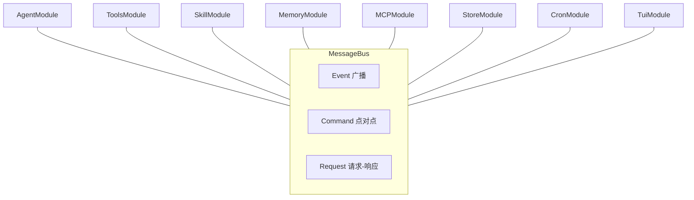
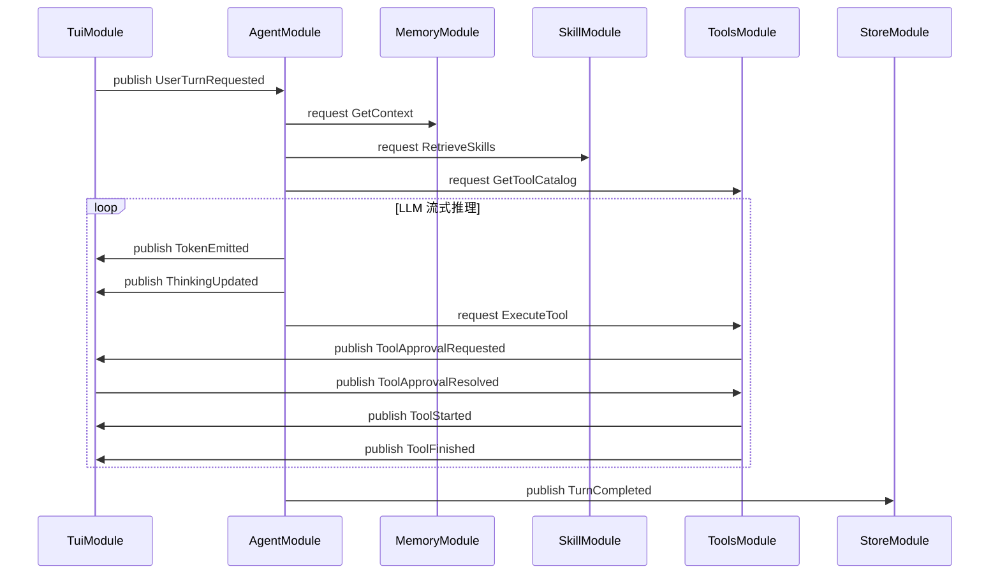
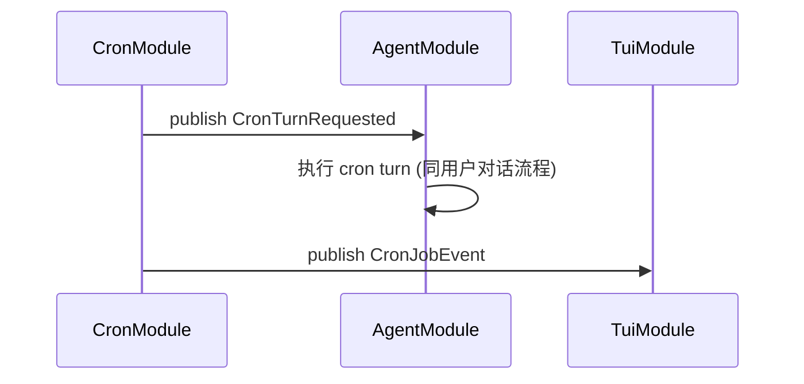
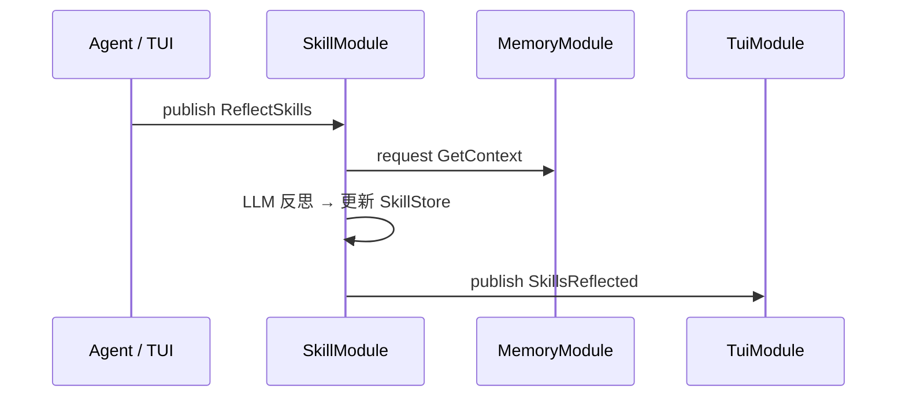
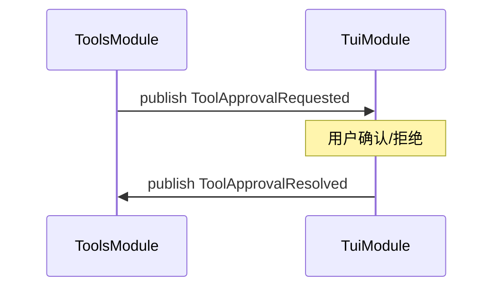

# Bus 事件速查表 (`alex/kernel/contracts/`)

每个模块通过 `MessageBus` 通信。本表以模块为索引，列出各自 **订阅** 的事件、**发布** 的事件和 **提供** 的 request handler。

消息语义：**Event** = 广播 pub/sub | **Command** = 点对点 | **Request** = 点对点有返回值

---

## 总览

8 个模块全部通过 MessageBus 通信，模块间零直接导入。

---

## AgentModule

| 方向 | 消息类型 | 语义 | 说明 |
|------|---------|------|------|
| **订阅** | `UserTurnRequested` | Command | TUI 发布 → Agent 执行用户对话 |
| **订阅** | `CronTurnRequested` | Command | CronModule 发布 → Agent 执行 cron 对话 |
| **发布** | `TurnStarted` | Event | 每轮对话开始 |
| **发布** | `TurnCompleted` | Event | 每轮对话完成（StoreModule 订阅 → 持久化） |
| **发布** | `TurnFailed` | Event | 对话异常 |
| **发布** | `ThinkingUpdated` | Event | LLM 推理 token（DeepSeek thinking mode） |
| **发布** | `TokenEmitted` | Event | LLM 回复 token |
| **发布** | `SkillLoaded` | Event | `load_skill` 工具被调用 |
| **发布** | `ReflectSkills` | Command | 本轮无技能匹配时自动触发反思 |

AgentModule 不直接 provide 任何 request handler。它通过 `bus.request(...)` 调用其他模块的能力：

| 调用的 Request | 目标模块 | 用途 |
|---------------|---------|------|
| `GetContext` | Memory | 获取对话历史 |
| `AppendMessages` | Memory | 追加消息 |
| `RetrieveSkills` | Skill | 检索匹配技能 |
| `LoadSkill` | Skill | 加载技能详情 |
| `GetToolCatalog` | Tools | 获取工具目录 |
| `ExecuteTool` | Tools | 执行工具 |

---

## ToolsModule

| 方向 | 消息类型 | 语义 | 说明 |
|------|---------|------|------|
| **提供** | `GetToolCatalog` | Request | 返回合并后工具目录（builtin + MCP + plugin） |
| **提供** | `ExecuteTool` | Request | 执行工具（含权限检查） |
| **提供** | `InvokeProviderTool` | Request | 转发工具执行到外部 provider |
| **提供** | `RegisterTool` | Request | 动态注册工具（SkillModule 注册 load_skill 等） |
| **提供** | `UnregisterTool` | Request | 动态移除工具 |
| **订阅** | `ToolsProvided` | Event | 收编 MCP / plugin 广播的工具到目录 |
| **订阅** | `ToolApprovalResolved` | Event | TUI 确认/拒绝权限后回执 |
| **发布** | `ToolsProvided` | Event | 启动时广播内建工具目录 |
| **发布** | `ToolStarted` | Event | 工具执行开始（TUI 订阅渲染） |
| **发布** | `ToolFinished` | Event | 工具执行完成（TUI 订阅渲染） |
| **发布** | `ToolApprovalRequested` | Event | 需要用户确认权限（TUI 订阅弹窗） |

---

## SkillModule

| 方向 | 消息类型 | 语义 | 说明 |
|------|---------|------|------|
| **提供** | `RetrieveSkills` | Request | 按 query 检索匹配技能 → `list[SkillCard]` |
| **提供** | `LoadSkill` | Request | 按名加载技能完整详情 → `SkillCard` |
| **提供** | `ListSkills` | Request | 列出所有技能 |
| **提供** | `DeleteSkill` | Request | 删除技能（按名/前缀匹配） |
| **提供** | `DeprecateSkill` | Request | 废弃技能 |
| **提供** | `GetSkillName` | Request | 按 ID 查技能名 |
| **提供** | `RecordSkillUsage` | Request | 记录技能使用反馈 |
| **提供** | `MergeSkills` | Request | LLM 驱动技能去重合并 |
| **订阅** | `ReflectSkills` | Command | 触发技能反思（Agent / TUI 发布） |
| **订阅** | `FeedbackSubmitted` | Command | 用户反馈（Ctrl+G / Ctrl+B）→ 记录 usage + 差评触发反思 |
| **发布** | `SkillsReflected` | Event | 反思完成 → TUI toast 通知 |

SkillModule 启动时还通过 `bus.request(RegisterTool(...))` 向 ToolsModule 注册两个内置工具：
- `load_skill` — 按名加载技能完整执行流程
- `list_skills` — 浏览可用技能列表

---

## MemoryModule

| 方向 | 消息类型 | 语义 | 说明 |
|------|---------|------|------|
| **提供** | `GetContext` | Request | 获取会话上下文 → `list[dict]` |
| **提供** | `AppendMessages` | Request | 追加消息 |
| **提供** | `ReplaceMemory` | Request | 替换全部记忆 |
| **提供** | `ClearMemory` | Request | 清空记忆 |

MemoryModule 不订阅任何事件，不主动发布。纯粹的能力提供者。

---

## MCPModule

| 方向 | 消息类型 | 语义 | 说明 |
|------|---------|------|------|
| **提供** | `InvokeProviderTool` | Request | 执行 MCP server 工具（由 ToolsModule 转发） |
| **发布** | `ToolsProvided` | Event | 后台连接成功后广播 MCP 工具 spec → ToolsModule 收编 |

MCPModule 启动时创建后台 `asyncio.Task` 连接所有 MCP servers，不阻塞启动。连接成功后通过 `ToolsProvided` 广播工具，ToolsModule 订阅并合并到统一目录。

---

## CronModule

| 方向 | 消息类型 | 语义 | 说明 |
|------|---------|------|------|
| **提供** | `ScheduleCron` | Request | 调度新 cron 任务 → 返回 `job_id` |
| **提供** | `CancelCron` | Request | 取消 cron 任务 → 返回 `bool` |
| **提供** | `ListCronJobs` | Request | 列出所有 cron 任务 → `list[dict]` |
| **发布** | `CronTurnRequested` | Command | Cron 触发 → AgentModule 订阅并执行 |
| **发布** | `CronJobEvent` | Event | Job 状态变更（SCHEDULED / CANCELLED / RUNNING）→ TUI 订阅刷新 |

---

## StoreModule

| 方向 | 消息类型 | 语义 | 说明 |
|------|---------|------|------|
| **提供** | `ListSessions` | Request | 列出历史会话 |
| **提供** | `LoadSession` | Request | 加载指定会话数据 → `list[dict] \| None` |
| **订阅** | `TurnCompleted` | Event | Agent 发布 → 自动持久化当前会话 |
| **发布** | `SessionRestored` | Event | 会话恢复成功通知 |

---

## TuiModule

| 方向 | 消息类型 | 语义 | 说明 |
|------|---------|------|------|
| **订阅** | `TurnStarted` | Event | 渲染 turn 开始 |
| **订阅** | `TokenEmitted` | Event | 追加流式回复文本 |
| **订阅** | `ThinkingUpdated` | Event | 追加思考过程文本 |
| **订阅** | `SkillLoaded` | Event | 渲染技能加载提示 |
| **订阅** | `ToolStarted` | Event | 渲染工具调用气泡 |
| **订阅** | `ToolFinished` | Event | 更新工具输出结果 |
| **订阅** | `TurnCompleted` | Event | 最终化 bubble |
| **订阅** | `TurnFailed` | Event | 错误提示 |
| **订阅** | `SkillsReflected` | Event | Toast 反思结果 |
| **订阅** | `CronJobEvent` | Event | 刷新后台任务状态栏 |
| **订阅** | `ToolApprovalRequested` | Event | 弹出权限确认弹窗 |
| **发布** | `UserTurnRequested` | Command | 用户输入 → AgentModule 订阅执行 |
| **发布** | `ToolApprovalResolved` | Event | 用户确认/拒绝权限 → ToolsModule 订阅回执 |

TuiModule 是唯一不 provide 任何 request handler 的模块——它是纯消费者 + 事件发射器。TUI 的 `/reflect`、`/merge-skills`、`/skills` 等命令通过 `bus.request(...)` 直接调用对应模块。

---

## 典型数据流

### 用户对话

### Cron 定时触发

### 技能反思

### 权限确认

